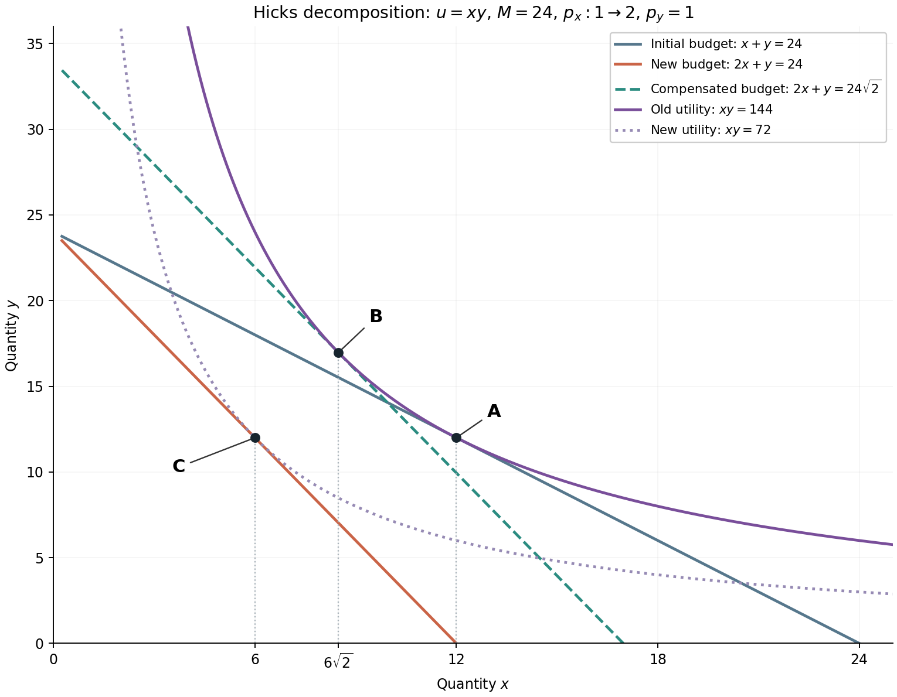

# A concrete standard for depth and prose

Read this once before a new course or a major rewrite. This is an original worked teaching excerpt, not a university handout, not an official solution, and not a fixed template or minimum length. The synthetic source task is: explain ordinary versus compensated demand, derive the interior solutions for positive prices and `u = xy`, work through a Hicks decomposition, interpret its geometry, and distinguish point elasticity from a finite price change. Each of those obligations needs its own substantive explanation.

An inadequate recap would say: “Ordinary demand fixes income; compensated demand fixes utility. With u = xy, x = M/(2px). For the compensated point use y = 2x and xy = 144, then subtract the three x-coordinates.” Those statements leave the reader to supply the most important decisions and reasoning.

The excerpt below demonstrates a developed account. Use the learner's preferred language in actual work. The closing notes explain which teaching decisions transfer to other subjects.

---

# 价格上涨后，为什么会少买：把两种变化分开看

我们先研究一个具体问题：某种商品涨价后，消费者减少购买，究竟是因为它相对另一种商品变贵了，还是因为原来的钱现在买不起同样多的东西了？这两种变化会同时发生。要分别理解它们，就需要构造一个中间状态，把其中一种影响暂时控制住。

设消费者购买两种可分割的商品，数量分别为 $x,y\geq0$，单价为 $p_x,p_y>0$，可支配收入为 $M>0$。本例用效用函数 $u(x,y)=xy$ 表示偏好。效用在这里用于比较不同消费组合的优劣；效用值翻倍，并不意味着幸福感可以被客观地说成翻倍。我们要比较的是选择，不是测量一种物理单位。

## 1 普通需求：手里的钱不变，怎样选择更满意的组合

普通需求，也称 Marshallian demand，回答的是“面对这些价格，拿着这笔收入，最愿意买什么”。可选择的数量满足预算约束 $p_xx+p_yy\leq M$，所以问题写成

$$\max_{x,y\geq0}xy
\quad\text{subject to}\quad p_xx+p_yy\leq M.$$

为什么求解时可以把预算约束写成等号？对这个例子，任一商品数量为零时，效用也是零；而正收入可以买到两种商品都为正的组合，得到正效用，因此最优选择不会落在这两个零数量边界上。在两种数量都为正时，再多一点任一商品都会增加效用。如果还剩钱，就能继续改善组合，因此最优点会花完预算。这是根据本例偏好得出的结论，不能在任意效用函数下不加判断地套用。

利用预算等式把 $y$ 表示成 $x$，就能看清“多买一点 $x$，必须放弃多少 $y$”：

$$y=\frac{M-p_xx}{p_y},\qquad
u(x)=\frac{Mx-p_xx^2}{p_y},\qquad
0\leq x\leq\frac{M}{p_x}.$$

这一步把两个变量的问题变成了一个变量的问题，同时保留了预算限制。现在对 $x$ 求导：

$$\frac{du}{dx}=\frac{M-2p_xx}{p_y}.$$

最优点处，把少量支出从一种商品挪到另一种商品，不应再能提高效用，因此内部最优点的导数为零。解得 $x=M/(2p_x)$。我们还要检查它是否真是最大值：二阶导数为 $-2p_x/p_y<0$，函数严格向下弯曲；求出的 $x$ 又位于可行区间内部，因此它确实是唯一最优值。代回预算等式得到

$$x^M(p_x,p_y,M)=\frac{M}{2p_x},\qquad
y^M(p_x,p_y,M)=\frac{M}{2p_y}.$$

上标 $M$ 表示 Marshallian，用来区分需求类型。这个结果意味着两种商品各获得一半支出：$p_xx^M=p_yy^M=M/2$。这是 $xy$ 这种对称偏好的性质，并不是所有消费者都会把收入平均分配。

## 2 补偿需求：满意程度不变，怎样以最低支出达到它

补偿需求，也称 Hicksian demand，改变了问题中被固定的东西。现在我们先规定一个目标效用 $\bar u>0$，再问“在当前价格下，至少达到这个水平，最少需要买什么、花多少钱”。它写成

$$\min_{x,y\geq0}(p_xx+p_yy)
\quad\text{subject to}\quad xy\geq\bar u.$$

这里固定的是目标效用，支出是求解结果；前一个问题固定的是收入，最大效用是求解结果。这种改变让我们能在比较价格时保持同一个效用水平，从而研究单独的替代反应。

最低支出时必有 $xy=\bar u$。如果严格超过目标，就可以把两种数量同时缩小一点，仍达到目标却减少支出，说明原组合还不够便宜。由于 $\bar u>0$，两种数量都必须为正，因此可以用 $y=\bar u/x$ 消去 $y$：

$$E(x)=p_xx+p_y\frac{\bar u}{x},\qquad x>0.$$

这个式子不是一个新的效用函数，而是“沿着目标效用曲线选择不同 $x$ 时，要付出的总支出”。求导并令其为零：

$$E'(x)=p_x-\frac{p_y\bar u}{x^2}=0
\quad\Longrightarrow\quad
x^H=\sqrt{\frac{p_y\bar u}{p_x}}.$$

舍去负根是因为数量为正。再由 $y=\bar u/x$ 得到

$$y^H=\sqrt{\frac{p_x\bar u}{p_y}},\qquad
e(p_x,p_y,\bar u)=2\sqrt{p_xp_y\bar u}.$$

其中 $x^H,y^H$ 是补偿需求，$e$ 是达到目标效用的最低支出。为什么导数为零给出最低点？因为 $E''(x)=2p_y\bar u/x^3>0$，支出函数严格向上弯曲，而且当 $x$ 趋向零或无穷时，支出都会趋向无穷。这里存在唯一的内部最低点。

同一个条件还有直观的几何含义。由 $xy=\bar u$ 求导可得无差异曲线的斜率 $dy/dx=-y/x$；等支出线 $p_xx+p_yy=E$ 的斜率是 $-p_x/p_y$。在本例光滑的内部最优点，两条线相切，所以 $y/x=p_x/p_y$。例如新价格为 $p_x=2,p_y=1$，便得到 $y=2x$。它来自最优选择的斜率条件，不是只要给定这两个价格，所有购买组合就必须满足的关系。

## 3 用三个明确的消费组合做 Hicks 分解

现在取 $M=24$，初始价格为 $p_x=p_y=1$，随后只把 $p_x$ 提高到 $2$。收入始终为 $24$，$p_y$ 始终为 $1$。

先算价格变化前后的实际选择。按普通需求，原组合为 $A=(12,12)$，原效用为 $u_A=144$。涨价后的实际组合为 $C=(6,12)$，效用为 $72$。因此 $x$ 的总变化为 $6-12=-6$，减少了六个数量单位。实际购买力下降和相对价格变化都已包含在这个结果中，还没有被分开。

为了单独观察替代反应，我们构造中间组合 $B$：使用**涨价后的价格**，但让消费者仍然达到**原来的效用 $144$**。它是一个假想的补偿状态，不是收入仍为 $24$ 时的实际最优选择。将新价格和旧效用代入刚推导的补偿需求：

$$x_B=\sqrt{\frac{1\times144}{2}}=6\sqrt2\approx8.485,
\qquad y_B=12\sqrt2\approx16.971.$$

也可以不用直接套公式来重建这个计算。新价格下，内部最优条件是 $y=2x$；旧效用条件是 $xy=144$。前一个条件决定在新价格下怎样搭配更省钱，后一个条件规定要达到哪一条效用曲线。二者一起给出 $2x^2=144$，所以 $x=6\sqrt2$，然后才得到 $y=12\sqrt2$。

达到组合 $B$ 的最低支出为

$$E_B=2(6\sqrt2)+12\sqrt2=24\sqrt2\approx33.941.$$

这比实际收入多约 $9.941$。补偿的意思是提供足以维持原效用的额外收入，同时允许消费者重新选择最省钱的组合。它不要求消费者坚持购买原来的 $(12,12)$；那个旧组合在新价格下要花 $36$，比达到同等效用的最低支出更高。

| 组合 | 使用的价格 | 固定或达到的条件 | $x$ | $y$ |
| --- | --- | --- | ---: | ---: |
| $A$：原实际选择 | $(1,1)$ | 收入 $24$，效用 $144$ | $12$ | $12$ |
| $B$：假想补偿选择 | $(2,1)$ | 保持旧效用 $144$，支出由最小化决定 | $6\sqrt2$ | $12\sqrt2$ |
| $C$：新实际选择 | $(2,1)$ | 实际收入仍为 $24$ | $6$ | $12$ |

从 $A$ 到 $B$，我们更换价格而保持效用不变，因此将这段 $x$ 的变化称为 Hicks 替代效应：

$$\Delta x_{\mathrm{sub}}=x_B-x_A=6\sqrt2-12\approx-3.515.$$

从 $B$ 到 $C$，价格保持为新价格，收入却从假想补偿支出回到实际的 $24$。这段变化是分解中的收入效应：

$$\Delta x_{\mathrm{income}}=x_C-x_B=6-6\sqrt2\approx-2.485.$$

“收入效应”不表示题目中的名义收入真的变了。它是借助假想中间状态，把价格上涨造成的购买力影响分离出来。两段相加恰好为 $-6$，与直接算出的总变化一致。

若在横轴画 $x$、纵轴画 $y$，原预算线是 $y=24-x$，新实际预算线是 $y=24-2x$，补偿线是 $y=24\sqrt2-2x$。补偿线与新实际预算线平行，因为价格相同；它与原效用曲线 $y=144/x$ 在 $B$ 相切。$A$ 和 $B$ 处于同一效用曲线，而 $B$ 和 $C$ 面对同一价格比。这两个对应关系，比机械记住“先走哪一个箭头”更能帮助你在换图或换数字时辨认两种效应。

图中紫色实线连接 $A,B$，表示它们的效用相同；绿色虚线与橙色线平行，表示 $B,C$ 面对相同的新价格。沿横轴读出 $12\to6\sqrt2\to6$，就能将图上的两个比较对应到上面的两段数量变化。浅紫色点线经过 $C$，表示涨价后实际达到的较低效用 $72$。

本例的两种效应都使 $x$ 减少，因为普通需求随收入增加，$\partial x^M/\partial M=1/(2p_x)>0$，所以 $x$ 是正常品。这个收入效应的方向不能不加条件地推广到劣等品；一般情形要回到具体偏好和需求关系判断。

## 4 弹性描述比例敏感程度，不是把斜率换个名字

普通需求的自身价格点弹性，在收入和另一商品价格保持不变时定义为

$$\varepsilon_x=\frac{\partial x^M}{\partial p_x}\frac{p_x}{x^M}.$$

第一个因子表示价格变一点时数量怎样变化，第二个因子把带单位的斜率转换成相对变化的比率。对本例，

$$\frac{\partial x^M}{\partial p_x}=-\frac{M}{2p_x^2},\qquad
\varepsilon_x=-\frac{M}{2p_x^2}\frac{p_x}{M/(2p_x)}=-1.$$

负号表示价格上升时需求下降。如果题目要求的是弹性的绝对值，就报告 $1$，同时保留这一方向解释。不要把普通需求的弹性自动用于补偿需求：二者在求导时固定的变量不同。

点弹性描述局部比例反应。它不能直接把一次价格翻倍解释成数量减少 $100\%$。在这次有限变化中，应直接使用需求函数：$p_x$ 翻倍使 $x^M=M/(2p_x)$ 减半，数量减少 $50\%$。即使点弹性在各点都等于 $-1$，有限百分比变化也需要按函数或相应的弧弹性定义计算。

## 5 独立练习：换一组条件后还能重建推理吗

以下为原创训练题，不是官方试题。仍令 $u=xy$，取 $M=30,p_x=1,p_y=2$，之后把 $p_x$ 提高到 $3$，其他条件不变。

求原实际组合和新实际组合；构造保持旧效用的补偿组合，并说明你联立的两个条件分别起什么作用；计算 $x$ 的两种效应并核对总变化；最后说明普通需求的点弹性绝对值，以及价格变为原来三倍时，实际需求减少了原来的多少比例。

> [!hint]- 提示
> 先计算原效用，再把它与新价格一起用于补偿问题。不要让中间状态同时满足旧收入和旧效用；它的最低支出应当由你算出来。

> [!success]- 完整解答与解释
> 原组合为 $A=(15,7.5)$，效用为 $112.5$；新实际组合为 $C=(5,7.5)$。
>
> 补偿点满足新价格的切线条件 $y/x=3/2$ 和旧效用条件 $xy=112.5$。代入得 $1.5x^2=112.5$，所以 $B=(5\sqrt3,7.5\sqrt3)\approx(8.660,12.990)$。前一个条件保证在新价格下选择最省钱的搭配，后一个条件保证效用不变。最低支出为 $30\sqrt3\approx51.962$。
>
> 替代效应为 $5\sqrt3-15\approx-6.340$，收入效应为 $5-5\sqrt3\approx-3.660$，相加为 $-10$，与 $5-15$ 一致。两种效应在这个正常品例子里都为负。
>
> 普通需求的点弹性为 $-1$，绝对值为 $1$。价格变成三倍后，需求变为原来的三分之一，因此减少了 $2/3$，约 $66.7\%$。应从需求函数计算这次有限变化，而不能用“点弹性绝对值为1”直接乘上 $200\%$。

---

## What to transfer from the example

The substance is not the number of headings or paragraphs. The developed account defines the two experiments, derives the needed optimum conditions instead of quoting them, connects constraints to their purposes, names intermediate states, checks results and interprets their meaning. The exercise changes conditions and requires reconstructing the method. A real course should additionally preserve its own supplied examples, visuals, qualifications and subparts; this standalone example does not license substituting a single generic problem for them.

The definitions of Marshallian and Hicksian demand were cross-checked against [MIT 14.121, Consumer Theory, physical pages 7 and 27](https://ocw.mit.edu/courses/14-121-microeconomic-theory-i-fall-2015/ea9f11b15ace05e7bfd31d58ae48beb9_MIT14_121F15_2S.pdf) and the interpretation of the two effects against [MIT 14.03, Lecture 6](https://ocw.mit.edu/courses/14-03-microeconomic-theory-and-public-policy-fall-2016/77133a410ec5ca8a525034dc4b40a902_MIT14_03F16_lec6.pdf). The prose, numerical scenarios, expanded derivations and exercise here were authored for this project; no course-specific page references are invented.
